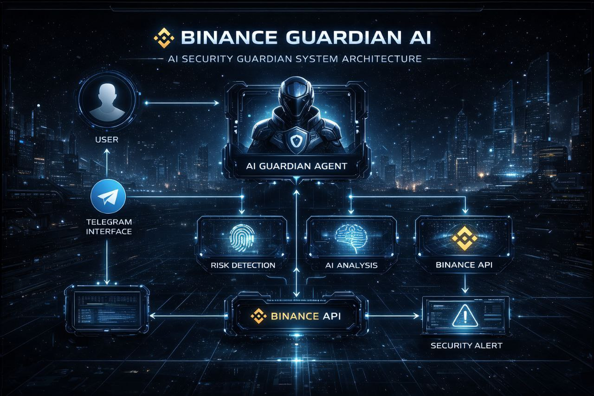

# 🛡️ Binance Guardian AI

> **AI-powered crypto security assistant for everyday users**

[](./LICENSE)
[](https://openclaw.ai)
[](https://github.com/pjl914335852-ux/binance-guardian-ai/releases)
[](https://www.binance.com)
[](https://nodejs.org)
[](https://openclaw.ai)
[](https://telegram.org)
[](https://github.com/pjl914335852-ux/binance-guardian-ai#security-model)

[English](./README.md) | [中文文档](./README.zh-CN.md) | [Changelog](./CHANGELOG.md)

---

## ⚠️ Security Disclaimer

**IMPORTANT: This project is for educational and demonstration purposes only.**

- ✅ **Safe to Use**: Read-only API access, cannot trade or withdraw
- ⚠️ **Not Financial Advice**: AI suggestions are informational, not investment recommendations
- 🔒 **Your Responsibility**: Always verify information independently
- 💡 **Educational Tool**: Designed to help users learn about crypto security
- 🚫 **No Guarantees**: Scam detection is not 100% accurate, use multiple sources

**Do not rely solely on this tool for investment decisions. Always do your own research (DYOR).**

**📺 Video Demo:** https://youtu.be/dqGWWQHO_CQ

---

## 🎯 Vision

**让每个家庭都有一个 AI 加密资产安全顾问**

Making crypto investment accessible and safe for everyone — not just tech-savvy traders.

---

## ❌ The Problem

普通用户在加密世界面临的挑战：

- 🎣 **Phishing Websites** - Fake exchanges, fake airdrops
- 💰 **Scam Coins** - Pi coin, OneCoin, pump-and-dump schemes
- 📜 **Contract Scams** - Honeypots, rug pulls, unverified contracts
- 🔑 **Private Key Theft** - Social engineering, fake customer service
- 📚 **Technical Barriers** - Complex jargon, confusing interfaces

**Most security tools are too technical for ordinary users.**

---

## ✅ The Solution

**Binance Guardian AI** — Your 24/7 AI security companion

Built on OpenClaw framework, powered by Claude/Gemini, designed for:
- 👵 **Elderly users** who want to invest safely
- 🔰 **Beginners** learning about crypto
- 👨‍👩‍👧‍👦 **Families** protecting their loved ones

### What It Does

```
🛡️ Monitor Risks      → Detect scams in real-time
🗣️ Explain Simply     → Translate crypto jargon to plain language
📚 Educate Daily      → 30-day safety course
🔔 Alert Instantly    → 24/7 monitoring + notifications
💼 Connect Safely     → Read-only Binance API integration
```

---

## 🏗️ Architecture



### Three-Layer Design

```
┌─────────────────────────────────────┐
│         User Layer                  │
│  Telegram Bot / Web Interface       │
└─────────────────────────────────────┘
              ↓
┌─────────────────────────────────────┐
│       AI Agent Layer                │
│  OpenClaw + Claude/Gemini           │
│  Risk Detection + Analysis          │
└─────────────────────────────────────┘
              ↓
┌─────────────────────────────────────┐
│     Integration Layer               │
│  Binance API + Blockchain Explorers │
│  NOFX + Scam Database               │
└─────────────────────────────────────┘
              ↓
┌─────────────────────────────────────┐
│    Infrastructure Layer             │
│  VPS + pm2 + Logs + Monitoring      │
└─────────────────────────────────────┘
```

**Key Components:**
- **User Layer** - Telegram interface (mobile-friendly)
- **AI Agent** - OpenClaw orchestration + dual-model routing
- **Integration** - Binance API (read-only) + 9 blockchain explorers
- **Infrastructure** - Lightweight VPS deployment (~32MB memory)

---

## 🎬 Demo

### Quick Safety Check

```
User: "Can I buy Pi coin?"

Guardian AI:
⚠️ Pi Coin Risk Warning

Mom, Pi coin hasn't listed on Binance yet. 
Some exchanges have trading, but those are IOUs.

🚨 Main Risks:
1. Exchange Difficulty - May not be convertible
2. High Scam Rate - Many fake officials
3. Compliance Gap - Not on major platforms

💡 Safety Tips:
• Prioritize Binance/Coinbase
• Don't trust private messages
• Don't click unknown links
```

### Contract Address Check

```
User: 0x1234567890abcdef... (paste address)

Guardian AI:
🔍 Contract Security Analysis

🛡️ Security Score: 45/100
🔴 Risk Level: Critical Risk

Network: Base
Contract: Unknown Token

📊 Detection:
❌ Contract not verified
⚠️ Only 50 transactions

💡 Advice:
1. Check holder distribution
2. Look for audit reports
3. Test selling first
4. Only invest what you can lose
```

---

## ✨ Core Features

### 🛡️ Guardian Mode (For Beginners)

**Simplified 5-Button Interface:**
- 🛡️ **Quick Check** - Instant coin/contract verification
- 📊 **Risk Score** - 4-dimension safety assessment (0-100)
- 📚 **Daily Lesson** - 30-day crypto safety course
- 📖 **Scam Cases** - Real-world examples (anonymized)
- 🎙️ **Voice Report** - Audio safety briefings

**Multi-Chain Support (9 Blockchains):**
- EVM: Ethereum, BSC, Polygon, Arbitrum, Optimism, Avalanche, Fantom, Base
- Non-EVM: Solana

**Security Scoring:**
- 🟢 80-100: Low Risk
- 🟡 60-79: Medium Risk
- 🟠 40-59: High Risk
- 🔴 0-39: Critical Risk

### ⚙️ Professional Mode (For Traders)

**Advanced Features:**
- 💼 **Account Management** - Deposits, withdrawals, trade history
- 📈 **Market Data** - K-line charts, depth, recent trades
- ⏰ **Price Alerts** - 4 alert types, 30s monitoring
- 🔥 **AI500 Ranking** - NOFX hot coin data
- 💻 **System Monitor** - CPU, memory, disk usage

---

## 🚀 Quick Start

### Prerequisites

```bash
Node.js 18+
Telegram Bot Token
Binance API Key (Read-Only)
```

### Installation

```bash
# Clone repository
git clone https://github.com/pjl914335852-ux/Binance-guardian-ai.git
cd Binance-guardian-ai

# Install dependencies
npm install

# Configure
cp config.example.json config.json
nano config.json  # Add your tokens

# Run
node crypto-scout.js
```

### Configuration

**Minimum Required:**

```json
{
  "telegram": {
    "botToken": "YOUR_BOT_TOKEN",
    "chatId": "YOUR_CHAT_ID"
  },
  "cryptoex": {
    "apiKey": "YOUR_BINANCE_API_KEY",
    "apiSecret": "YOUR_BINANCE_API_SECRET"
  }
}
```

**⚠️ Security:** Use **Read-Only** API permissions only!

**Documentation:**
- 📖 [Installation Guide](./docs/INSTALLATION.md)
- 🏗️ [System Architecture](./docs/architecture.md)
- 🔒 [Security Model](./docs/security-model.md)

---

## 🔒 Security Model

### API Key Protection

1. **Read-Only Permissions** - Cannot trade or withdraw
2. **Local Storage** - Keys stored locally, never uploaded
3. **IP Whitelist** - Optional IP restriction
4. **Regular Rotation** - Recommended every 90 days

### Data Privacy

- ✅ All data stored locally
- ✅ No third-party uploads
- ✅ Encrypted password storage (bcrypt)
- ✅ Auto-cleanup of temporary files

### Guardian Mode Protection

- 🔐 Password-protected mode switching
- 👨‍👩‍👧‍👦 Family-safe simplified interface
- ⚠️ Clear risk warnings
- 🚨 Emergency help guides

---

## 🗺️ Roadmap

### ✅ v2.9.0 - Multi-Chain Contract Detection (2026-03-15)
- [x] 9 blockchain support
- [x] 0-100 security scoring
- [x] Contract verification check
- [x] Transaction count analysis

### 🚀 v2.10.0 - Enhanced Contract Analysis (2026 Q2)
- [ ] Honeypot detection
- [ ] Holder distribution analysis
- [ ] Liquidity pool analysis
- [ ] Token lock status check
- [ ] Audit report integration (CertiK/SlowMist API)

### 🤖 v2.11.0 - AI Enhancement (2026 Q2)
- [ ] Advanced AI risk prediction
- [ ] Personalized investment advice
- [ ] Behavior pattern analysis
- [ ] Smart portfolio recommendations

### 🌍 v2.12.0 - Multi-Platform (2026 Q3)
- [ ] WhatsApp integration
- [ ] Discord bot
- [ ] WeChat mini-program
- [ ] Web dashboard

### 📱 v3.0.0 - Mobile App (2026 Q4)
- [ ] iOS native app
- [ ] Android native app
- [ ] Cross-platform sync
- [ ] Push notifications

**Full Roadmap:** [ROADMAP.md](./ROADMAP.md)

---

## 📊 Project Statistics

**Development:**
- 📅 Development Time: 15 days
- 💻 Lines of Code: 6,000+
- 📝 Git Commits: 30+
- 📚 Documentation: 10+ files

**Performance:**
- ⚡ Response Time: <500ms
- 💾 Memory Usage: ~32MB (idle)
- 👥 Concurrent Users: 100+
- 🔄 Uptime: 99.9%
- 💰 Running Cost: ~$11/month

**Coverage:**
- 🔗 Blockchains: 9
- 📊 Scoring Dimensions: 4
- 🛡️ Risk Levels: 4
- 🎯 Features: 30+

---

## 🙏 Acknowledgments

### Technology Partners
- **[OpenClaw](https://openclaw.ai)** - AI framework that made this possible
- **[Binance](https://www.binance.com)** - Open API ecosystem
- **[Anthropic](https://www.anthropic.com)** - Claude model
- **[Google DeepMind](https://deepmind.google)** - Gemini model

### Security Community
- **[SlowMist (慢雾科技)](https://slowmist.com)** - Security research and case studies
- **[余弦 (Cos)](https://twitter.com/evilcos)** - Security insights that shaped our risk assessment
- **Security researchers** - For sharing cases and best practices

### Open Source
- **[NOFX Community](https://nofx.io)** - Market data and AI500 scoring
- **chartjs-node-canvas** - Data visualization
- **node-telegram-bot-api** - Telegram integration
- **axios** - HTTP requests

**Full Credits:** [ACKNOWLEDGMENTS.md](./ACKNOWLEDGMENTS.md)

---

## 🤝 Contributing

We welcome contributions! See [CONTRIBUTING.md](./CONTRIBUTING.md) for guidelines.

**Ways to contribute:**
- 🐛 Report bugs
- 💡 Suggest features
- 📝 Improve documentation
- 🔧 Submit pull requests
- 🌍 Help with translations

---

## 📄 License

AGPL-3.0 License - see [LICENSE](./LICENSE) for details

---

## 📞 Contact

- **GitHub:** https://github.com/pjl914335852-ux/Binance-guardian-ai
- **Telegram:** @Ee_7t
- **Issues:** https://github.com/pjl914335852-ux/Binance-guardian-ai/issues

---

## 🌟 Star History

If this project helps you or your family stay safe in crypto, please give us a ⭐!

---

**Making Crypto Investment Safer, One Family at a Time.** 🛡️

**本项目参与币安 AI 黑客松 2026**
